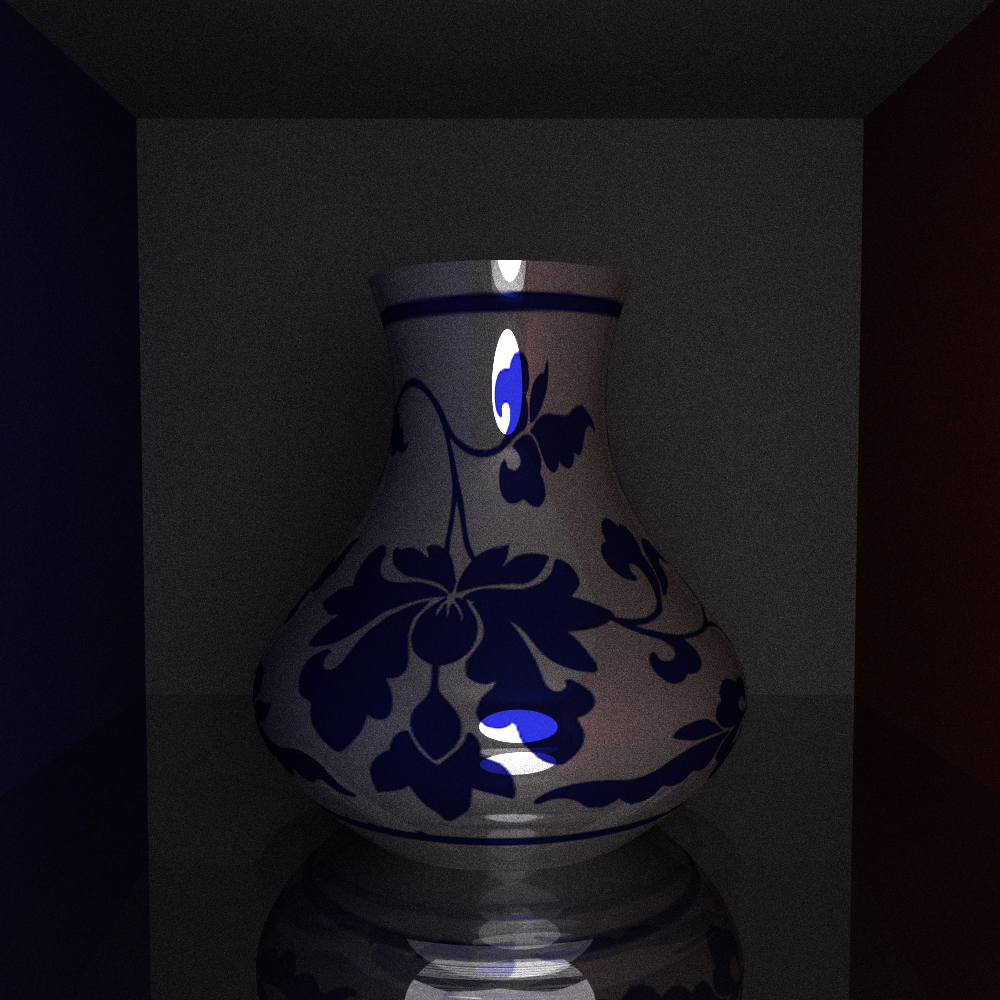
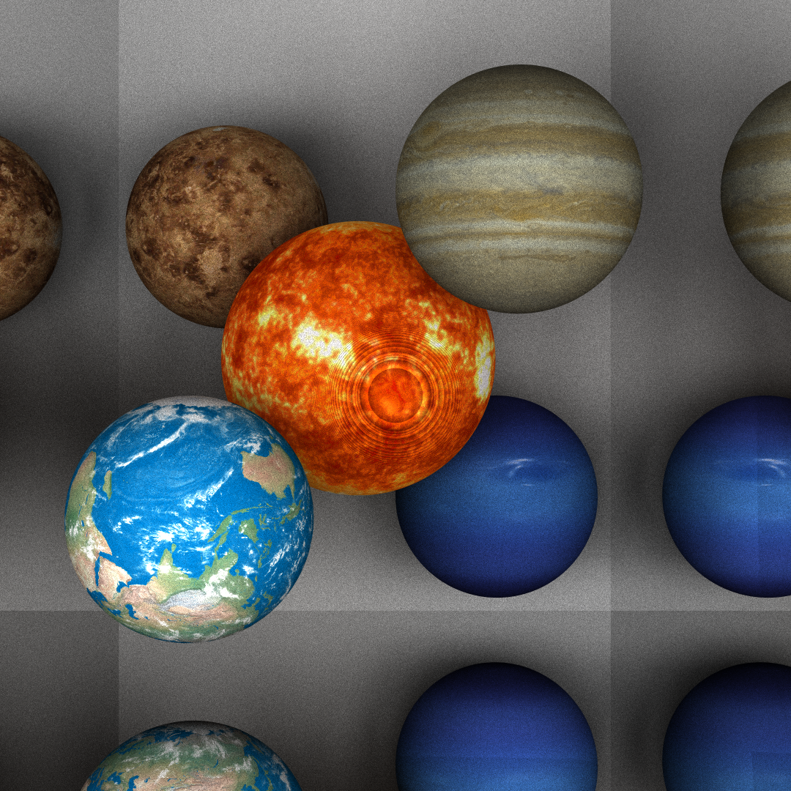

# 真实感图像渲染报告
计16 刘蕴皓 2021012884
## 项目概述
基于于路径跟踪（Path Tracing）算法，实现了支持处理反射、折射、纹理，支持处理bezier旋转曲面渲染，并支持三角网格模型导入的图像渲染引擎。算法整体使用了包围盒进行加速。
## 代码结构
沿用了PA1、PA2的整体架构，其中具体图例的渲染可由修改run_all.sh运行。
• include/: 算法实现
• src/: 主函数代码和纹理、场景、图片加载和保存等函数的具体实现。
• texture/:贴图。
• testcase/: 场景描述文件。
• mesh/:3D obj 文件。
• output/:输出目录
## 算法选型
本次代码选用了路径跟踪（Path Tracing）算法，具体实现见于include/pt.hpp。
路径追踪算法主要参考了smallpt,即从观测者位置的每一像素点向场景发射一条视线，根据与场景中物体的相交情况，决定其最终着色。若视线终止于背景，则直接返回背景色，否则根据交点物体的材质情况，计算视线经过此交点的朝向，迭代积累下一个交点的颜色。
模仿smallpt,这里并未对交点为发光物的情况进行特殊处理，而是采用俄罗斯轮盘赌的算法，在迭代超过一定深度时设置一概率，使其每一步均有此概率直接返回该交点的颜色结束迭代。
此外，考虑到漫反射面的反射光线和其他不确定情况，这里采用蒙特卡洛方法，随机取样对同一点的视线及其周围少量点位进行多次追踪，结果取均值。这也是抗锯齿方法的实现。

 

##  曲面求交
curve和revsurface内容大多继承自PA2，本次代码中主要实现了ray与旋转曲面求交的方式。
参考教材，使用牛顿迭代法来求解参数曲面与光线的交点。通过光线的原点和方向，以及求交时间参数 t，计算出光线与参数曲面的参数坐标 theta 和 mu。初始时，设置迭代次数为 0，并初始化交点的位置和参数坐标。在每次迭代中，计算当前交点处的法向量和点坐标，以及光线方向与法向量的点乘。根据牛顿迭代法的更新规则，更新交点的位置和参数坐标，直到满足终止条件。
在迭代过程中，如果交点的参数坐标 mu、theta 或 t 不是有效值，或者 t 小于 0 或大于当前记录的最近交点时间，则迭代失败，返回 false。
如果迭代成功得到交点，则根据交点的参数坐标获取材质的颜色，并将交点的信息（时间 t、材质、法向量、颜色和位置）更新到 Hit 对象中。

## 算法加速
### 包围盒
实现了位于bound.hpp中的box包围盒用于加速。即使用一个初始值极大的包围盒容纳所有场景元素，在求交过程中不断更新包围盒的边界大小以使其对元素大小的描述渐趋精确。对于每条光线，可通过与包围盒的求交来快速判定是否与对应的复杂结构相交。
### kd-tree
针对光线与物体求交时的算法，对物体构建了kdtree以加速查找。
## 效果实现
### 纹理
使用合适的图像加载库（STB Image）加载纹理图像文件，并获取图像的宽度、高度和通道数。将图像数据存储在适当的数据结构中。
根据纹理坐标的输入形式（整数或浮点数），实现获取对应的纹理坐标的UV展开函数。这些函数将纹理坐标转换为图像中对应的位置，并进行边界限制（确保不超出图像范围）。根据纹理坐标获取的位置，从图像数据中提取对应位置的颜色值。根据图像的通道数，将颜色值转换为范围在 [0, 1] 的浮点数。
在渲染过程中，根据物体表面的纹理坐标，在每个像素点上应用纹理。使用获取的纹理颜色替代原始的表面颜色，从而呈现出纹理效果。

### 抗锯齿
如上所述，在计算着色时采用随机方法对周围点位采样并平均，使颜色过渡更为平滑。
### 软阴影
PT算法自带效果，不再赘述。